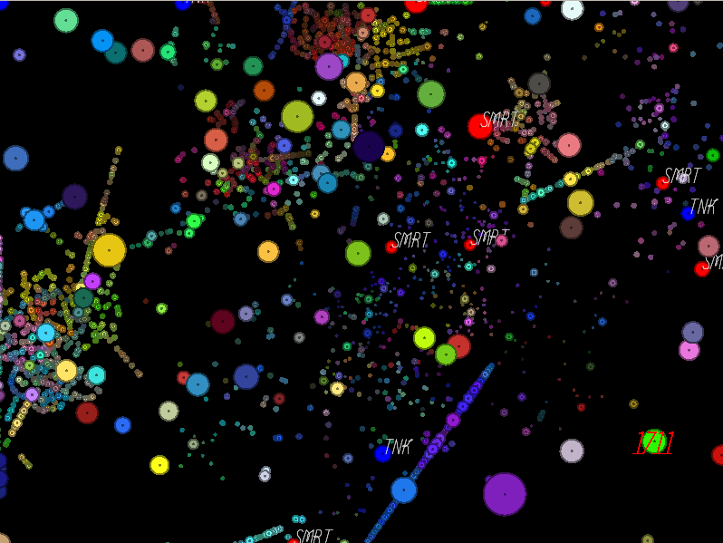

# artifish

Artificial Life Evolving Code -- Fishes

> Evolving Turing machines in custom physics world?
> Enough complexity and emergence for a lifetime!

Currently on hold until we figure out some of the really hard parts.

_September 2022 Update: Ideas are boiling, restarting soon._

